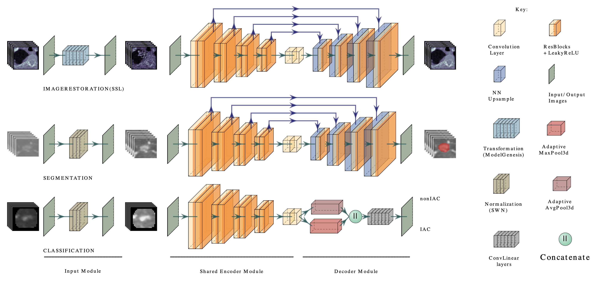

# Lung-PNet



Lung-PNet is an end-to-end deep transfer learning network designed for the diagnosis of invasive adenocarcinomas (IAC) in pure ground-glass nodules (pGGNs) on non-enhancement high-resolution CT (HRCT). 

The objective of Lung-PNet is to develop and validate an end-to-end 3D deep learning model pipeline for the detection of IAC histologic subtypes of pGGNs. 

Lung-PNet was developed in a retrospective study to automatically segment pGGN lesions and classify IAC subtypes in a single-center lung CT image of patients who underwent surgical resection for pulmonary nodules between January 2019 and June 2022. The model’s performance was evaluated using a Dice score to measure its ability to detect and segment pGGNs, and the area under the receiver operating characteristic curve (AUC) to measure its ability to classify pGGNs.


## Install
pip install requirements.txt

## for self supervised pretraining
```
python self_supervised_learning/train_self_supervised_ct.py
```
## for pGGN level segementation
```
python segmentation/train_segmentation_pggn.py
```
## for pGGN classification
```
python classification/train_classification_pggn.py
```
## Citing Lung-PNet
if you find this repository useful, please consider giving a star :star: and citation: Qi K, Wang K, Wang X, et al. Lung-PNet: An Automated Deep Learning Model for the Diagnosis of Invasive Adenocarcinoma in Pure Ground-Glass Nodules on Chest CT. AJR 2023 Jul 26 [published online]. Accepted manuscript. doi:10.2214/AJR.23.29674
```
@ARTICLE{doi:10.2214/AJR.23.29674,
  title     = "{Lung-PNet}: An automated deep learning model for the diagnosis
               of invasive adenocarcinoma in pure ground-glass nodules on chest
               {CT}",
  author    = "Qi, Kang and Wang, Kexin and Wang, Xiaoying and Zhang, Yu-Dong
               and Lin, Gang and Zhang, Xining and Liu, Haibo and Huang,
               Weiming and Wu, Jingyun and Zhao, Kai and Liu, Jing and Li, Jian
               and Zhang, Xiaodong",
  journal   = "AJR Am. J. Roentgenol.",
  publisher = "American Roentgen Ray Society",
  volume    =  222,
  number    =  1,
  pages     = "e2329674",
  month     =  jan,
  year      =  2024,
  keywords  = "CT; deep learning; invasive adenocarcinoma; pure ground-glass
               nodule",
  language  = "en"
}
```
